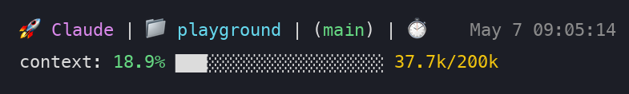

# claude-code-statusline

A two-line status line for [Claude Code](https://docs.claude.com/en/docs/claude-code/statusline) that shows the current model, working directory, git branch, date + time, and accurate context-window usage with a progress bar.



## What it shows

**Line 1** — model · `📁 cwd` · `(branch)` · `⏱️  May 7 09:05:14`

**Line 2** — `context: 18.9% ███░░░░░░░░░░░░░░░░░ 37.7k/200k`

Context usage is computed from the transcript by summing `input_tokens + cache_read_input_tokens + cache_creation_input_tokens` on the most recent main-thread assistant turn (sub-context, synthetic, error, and "no response requested" turns are excluded). The percentage is colored green / yellow / red at 70 % and 90 % thresholds.

## Install

1. Drop `statusline.py` somewhere on your machine and make it executable:

   ```bash
   git clone https://github.com/Servosity/claude-code-statusline.git
   chmod +x claude-code-statusline/statusline.py
   ```

2. Point Claude Code at it. In `~/.claude/settings.json`:

   ```json
   {
     "statusLine": {
       "type": "command",
       "command": "/absolute/path/to/claude-code-statusline/statusline.py"
     }
   }
   ```

   Or symlink it into the conventional location so updates are just `git pull`:

   ```bash
   ln -sf "$PWD/claude-code-statusline/statusline.py" ~/.claude/statusline.py
   ```

   and set `"command": "~/.claude/statusline.py"`.

3. Restart Claude Code (or start a new session) — the status line refreshes on every render.

## Configuration

Open `statusline.py` and edit the constants near the top:

| Constant | Default | What it controls |
| --- | --- | --- |
| `CONTEXT_WINDOW` | `200_000` | Total context budget used to compute the percentage. Bump to `1_000_000` for the 1M-context Opus tier. |

The model icon is selected from the model id: 🚀 Opus, 🧠 Sonnet, ⚡ Haiku, 🤖 anything else.

The date format lives on one line:

```python
now = datetime.now().strftime("%b %-d %H:%M:%S")
```

Swap `%b %-d` for `%Y-%m-%d` if you prefer ISO dates, or drop it entirely for time only.

## Requirements

- Python 3 (uses only the standard library — no pip install needed)
- A terminal that renders ANSI 256-color escape sequences (every modern terminal does)
- `git` on `$PATH` if you want the branch segment

## License

MIT — see [LICENSE](LICENSE).
