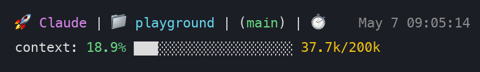

# claude-code-statusline

A two-line status line for [Claude Code](https://docs.claude.com/en/docs/claude-code/statusline) that shows the current model, working directory, git branch, date + time, accurate context-window usage with a progress bar, and session cost / tokens / duration.



## What it shows

**Line 1** — model · `📁 cwd` · `(branch)` · `⏱️  May 7 09:05:14`

**Line 2** — `context: [███░░░░░░░░░░░░░░░░░░░░░░░] 145k/1M 14.5% | $3.18 | 294k tok | 1h 12m`

**Context bar.** Usage is computed from the transcript by summing `input_tokens + cache_read_input_tokens + cache_creation_input_tokens` on the most recent main-thread assistant turn (sub-context, synthetic, error, and "no response requested" turns are excluded). The bar is **scaled to the real context window** — detected from the `context_window.context_window_size` field Claude Code passes on stdin (falling back to a `1m` marker in the model id, then to `200_000`), so a 1M-context model reads `/1M` instead of pinning full at 200k.

The bar is a **bracketed gradient** that reads as one continuous window. Filled cells (`█`) use a bright green→yellow→orange→red ramp; the empty track (`░`) shows a dim "heat-ahead" version of the same ramp, so you can see the spectrum that lies ahead without any divider glyphs. The gradient is **anchored to the 120k / 180k / 300k / 500k thresholds** (`green@0 → yellow@120k → orange@180k → red@300k → deep red@500k+`), so position-in-the-window maps to color. The percentage takes the gradient color at the current usage. Retune `GRAD_ANCHORS` / `GRAD_RAMP` / `GRAD_MUTED` to change the stops or palette.

**Session stats** (appended to line 2, each shown only when present):

- **cost** — `cost.total_cost_usd` from stdin (`$3.18`).
- **tokens** — cumulative tokens *processed* this session, **including subagent / Task (sidechain) turns**: `input + output + cache_read + cache_creation` summed across every transcript message. Cache reads recur per turn by design, so this is a processed total (pairs with cost), not a unique-token count.
- **duration** — `cost.total_duration_ms` from stdin, wall-clock since session start (`1h 12m`).

## Install

The script is a single file with **zero pip dependencies**. It uses [`uv`](https://docs.astral.sh/uv/) as the runner so the same source works on macOS, Linux, and Windows — and so users without a system Python can run it after a single `uv` install.

### 1. Install `uv`

**macOS / Linux**

```bash
curl -LsSf https://astral.sh/uv/install.sh | sh
```

**Windows (PowerShell)**

```powershell
powershell -ExecutionPolicy ByPass -c "irm https://astral.sh/uv/install.ps1 | iex"
```

Or use a package manager you already have: `brew install uv`, `winget install --id=astral-sh.uv`, `scoop install uv`, `pipx install uv`.

### 2. Get the script

```bash
git clone https://github.com/Servosity/claude-code-statusline.git
```

### 3. Wire it into Claude Code

Edit `~/.claude/settings.json` (or `%USERPROFILE%\.claude\settings.json` on Windows) and add:

**macOS / Linux** — the script's shebang (`#!/usr/bin/env -S uv run --script`) makes it directly executable, so point Claude Code straight at the file:

```json
{
  "statusLine": {
    "type": "command",
    "command": "/absolute/path/to/claude-code-statusline/statusline.py"
  }
}
```

If you'd rather keep `~/.claude/statusline.py` as the canonical path so updates are just `git pull`, symlink it:

```bash
ln -sf "$PWD/claude-code-statusline/statusline.py" ~/.claude/statusline.py
chmod +x ~/.claude/statusline.py   # already executable in the repo, harmless to repeat
```

**Windows** — shebangs aren't executable on Windows, so invoke `uv` explicitly:

```json
{
  "statusLine": {
    "type": "command",
    "command": "uv run \"C:\\path\\to\\claude-code-statusline\\statusline.py\""
  }
}
```

(Use forward slashes or escape the backslashes — both work.)

### 4. Restart Claude Code

The status line refreshes on every render after that. The first run downloads a managed Python interpreter via `uv` if you don't have one — subsequent runs are instant.

## Configuration

Open `statusline.py` and edit the constants near the top:

| Constant | Default | What it controls |
| --- | --- | --- |
| `BAR_WIDTH` | `26` | Width of the gradient bar in characters (excludes the `[ ]` brackets). |
| `DEFAULT_CONTEXT_WINDOW` | `200_000` | Fallback window when Claude Code doesn't report `context_window.context_window_size` and the model id has no `1m` marker. The window is auto-detected at runtime — no need to hard-code the 1M tier. |
| `GRAD_RAMP` | green→red 256-color list | Bright ramp for the filled cells (and the percentage color). |
| `GRAD_MUTED` | dim parallel ramp | "Heat-ahead" ramp for the empty track. |
| `GRAD_ANCHORS` | `[(0,0), (120k,5/11), (180k,8/11), (300k,10/11), (500k,1.0)]` | Token→gradient-fraction stops. Move these to shift where green/yellow/orange/red land. |

The model icon is selected from the model id: 🚀 Opus, 🧠 Sonnet, ⚡ Haiku, 🤖 anything else.

The date format is built from `datetime.now()`:

```python
_now = datetime.now()
now = f"{_now.strftime('%b')} {_now.day} {_now.strftime('%H:%M:%S')}"
```

This avoids the `%-d` / `%#d` strftime split between POSIX and Windows. Swap it for `_now.strftime("%Y-%m-%d %H:%M:%S")` for ISO format, or drop the date entirely for time only.

## Requirements

- [`uv`](https://docs.astral.sh/uv/) — handles the Python interpreter for you
- A terminal that renders ANSI 256-color escape sequences (every modern terminal does, including Windows Terminal)
- `git` on `PATH` if you want the branch segment

The PEP 723 inline metadata in the script (`# /// script` block) declares `requires-python = ">=3.9"`. `uv` reads this header on each run and provides a matching interpreter automatically.

## License

MIT — see [LICENSE](LICENSE).
